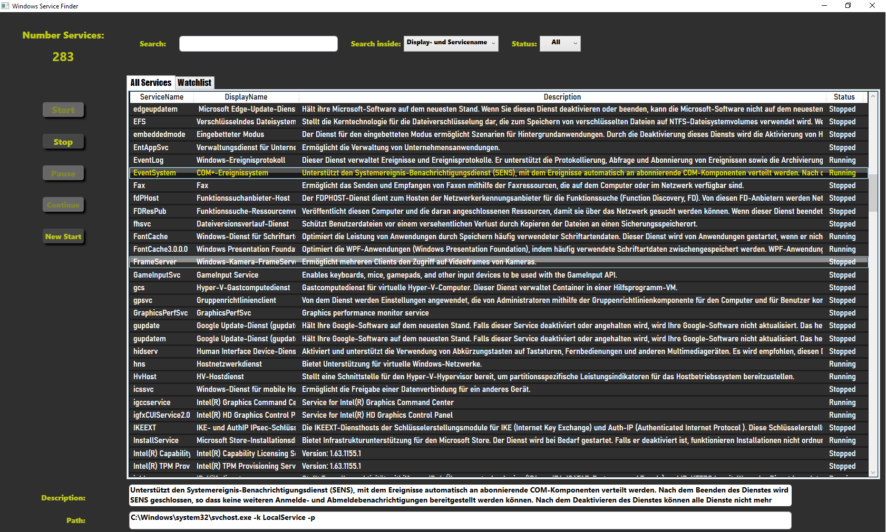

# Service Finder
Service Finder is a small windows application to quickly find services. 
 

---
### Key features
* Find services via search mask. Changes are displayed immediately
* 2 Filteroptions
   * search inside Displayname or services description
   * show only running or stopped services
* start, stop, pause, continue or new start your selected service
* put desired services to a watchlist (right click on selected service to open context menu)

---
### Screenshots

